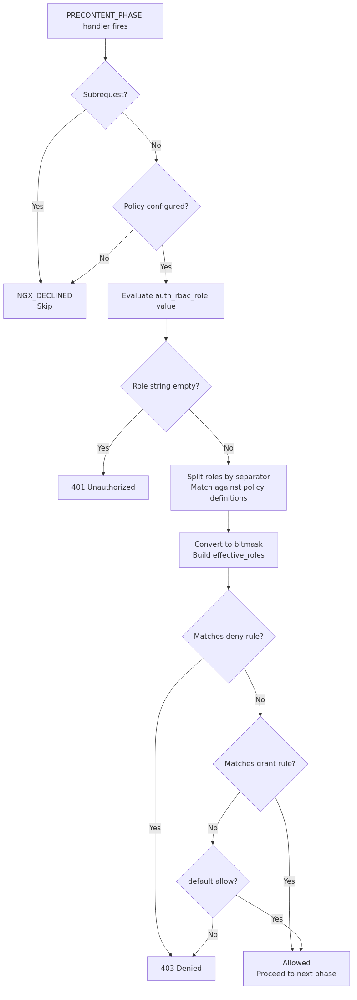

# nginx RBAC Module

## Overview

### About This Module

The nginx RBAC module is a dynamic module that adds Role-Based Access Control (RBAC) capabilities to nginx. It operates in nginx's PRECONTENT phase, making authorization decisions based on policy definitions.

By combining it with authentication modules (`oidc`, etc.), you can achieve flexible access control.

**License**: MIT License

### Key Features

- **Policy-based access control**: Centrally manage roles and rules in an `rbac_policy` block
- **Role hierarchy**: Efficient hierarchical evaluation using bitmasks (e.g., `admin > editor > viewer`)
- **Deny-first evaluation**: Deny rules are evaluated before grant rules
- **Flexible path matching**: Exact, prefix, and regex matching
- **Method constraints**: Per-rule HTTP method restrictions
- **Multiple role sources**: Comma-separated strings or JSON arrays
- **nginx variable provider**: Evaluation results are exposed as nginx variables

### Security

For best practices on deny-first evaluation and role header trust, see [SECURITY.md](docs/SECURITY.md).

## Quick Start

See [INSTALL.md](docs/INSTALL.md) for installation instructions.

### Minimal Configuration

```nginx
load_module modules/ngx_http_auth_rbac_module.so;

http {
    rbac_policy my_policy {
      role viewer;
      role editor > viewer;
      role admin > editor;
      grant admin /api;
      grant editor on GET,POST /articles;
      grant viewer /public;
      deny * =/admin/danger;
      default deny;
    }

    server {
        location / {
            auth_rbac my_policy;
            auth_rbac_role $http_x_user_roles;
            proxy_pass http://backend;
        }
    }
}
```

**Required elements**:
1. `rbac_policy`: Policy definition (roles, grant/deny rules, default behavior)
2. `auth_rbac`: Enable the policy (at server or location level)
3. `auth_rbac_role`: Source of the role value (nginx variable)

In this example:

- Roles are taken from the `$http_x_user_roles` header (`X-User-Roles`)
- `admin` can access everything under `/api` (and inherits `editor` and `viewer` permissions)
- `editor` can access `/articles` with `GET` and `POST`
- `viewer` can access `/public`
- `/admin/danger` is denied for all roles (deny takes priority)
- All other paths are denied by default

**More detailed configuration examples**: See [EXAMPLES.md](docs/EXAMPLES.md).

## Directives

See [DIRECTIVES.md](docs/DIRECTIVES.md) for details.

| Directive | Description | Context |
|---|---|---|
| `rbac_policy` | Define a policy block | http |
| `auth_rbac` | Enable RBAC | http, server, location |
| `auth_rbac_role` | Source of the role value | http, server, location |
| `auth_rbac_role_separator` | Separator for the role string | http, server, location |
| `auth_rbac_denied` | Response code when denied | http, server, location |
| `auth_rbac_unauthorized` | Response code when unauthenticated | http, server, location |

## Embedded Variables

See [DIRECTIVES.md](docs/DIRECTIVES.md#embedded-variables) for details.

| Variable | Description |
|----------|-------------|
| `$rbac_role` | Raw role string from the request |
| `$rbac_roles` | Comma-separated list of roles after hierarchy expansion |
| `$rbac_result` | RBAC evaluation result (`allowed` / `denied` / `unauthorized`) |
| `$rbac_matched_rule` | Text representation of the matched rule |

## Appendix

### Evaluation Flow Overview

The RBAC module operates in nginx's PRECONTENT phase. For each request, processing follows this order: role extraction, deny rule evaluation, grant rule evaluation, and default action. When a deny rule matches, the request is denied immediately — no grant rule can override it.



## Related Documentation

**Configuration & Operations**:

- [DIRECTIVES.md](docs/DIRECTIVES.md): Directive and variable reference
- [EXAMPLES.md](docs/EXAMPLES.md): Configuration examples for various use cases
- [INSTALL.md](docs/INSTALL.md): Installation guide (build instructions, dependencies)
- [SECURITY.md](docs/SECURITY.md): Security guidelines (deny-first evaluation, header trust, etc.)
- [TROUBLESHOOTING.md](docs/TROUBLESHOOTING.md): Troubleshooting (common issues, log inspection)

**Reference**:

- [CHANGELOG.md](CHANGELOG.md): Version history and release notes
